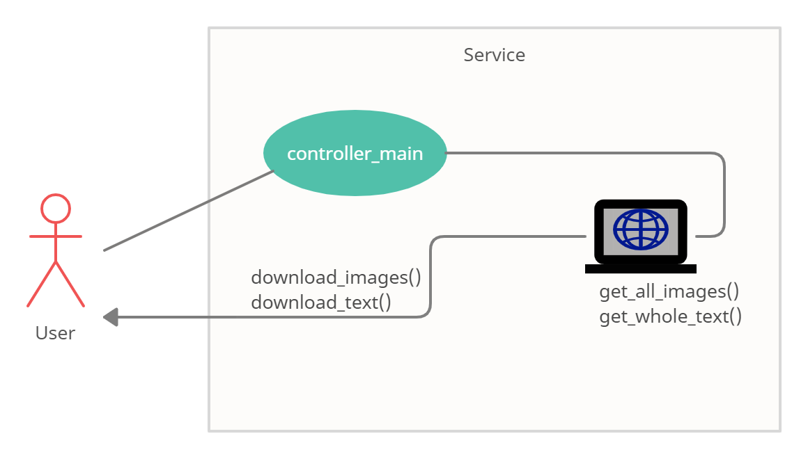

Image & Text Downloader
----


### Opis

----
Narzędzie służy do pobierania zawartości tekstowej podanej strony oraz plików graficznych znajdujących się na niej.
*System jest dostosowany dla platformy windows*

### Uruchomienie

----
**Docker** 
######Jeżeli użytkownik posiada zainstalowanego dockera:
w lini komend wpisać polecenie `run_service.bat <url> <dir_name>`

#####przykład: 
`run_service.bat https://lyapko.pl/produkt/aplikator-wieloiglowy-lyapko-stopka-b-plus/ lyapko`

----

**Python**
######W przypadku braku dockera serwis można uruchomić wykorzystując lokalną instalację pythona:
w lini komend wpisać polecenie:
 * `pip install -r requirements.txt`
 * `python main.py <url> <dir_name>`
 
 #####przykład:
 `python main.py https://lyapko.pl/produkt/aplikator-wieloiglowy-lyapko-stopka-b-plus/ lyapko`
 
----

###Architektura

----


###Testy

----
######W celu uruchomienia testów należy przejść do folderu `tests` oraz uruchomić plik `test_main.py`
***Uwaga:*** 
######W trakcie developmentu zauważyłem, że z modelowej strony są pobierane dwa pliki `html.png` oraz `django.png`. Są to puste pliki, które z niewiadomych mi przyczyn zmieniają swoje mdsum-y, na potrzeby zadania te zachowanie nie było dogłębnie analizowane.


###Komentarze

----

Ciekawe zadanie pozwalające na bardzo szeroki wachlarz możliwości do implementacji. Na potrzeby rekrutacyjne zrealizowałem je w powyższej formie.
Jeżeli miałbym więcej czasu przeznaczać na rozwinięcie serwisu myślę, że dobrze by było zaimplementować bazę danych. W mojej koncepcji wybrałem MongoDB.

W modelu danych Dokument reprezentowałby mniej więcej poniższą strukturę w najbardziej podstawowej formie
```
{
    "name": dev.zdrowed.pl,
    "content": [
        {"text": "examplary text from webpage"},
        {"images: [
            "image_url_1",
            "image_url_2",
            "image_url_3"
        ]
    ]
}
```

Na podstawie takiego modelu można spokojnie pobierać zawartość bez koniecnzości przechowywania plików binarnych w przypadku zdjęć. Oczywiście przy założeniu, że właściciel domeny nie zmieni zawartości strony.

Ciekawym doświadczeniem w przypadku tego zadania była możliwośc zapoznania się z Dockerem. Mogę domniemać, że powyższa implementacja kontenera nie jest cudem automatyzacji, jednak chętnie uczę się nowych i ciekawych technologii w związku z czym było to interesujące wyzwanie.

 

